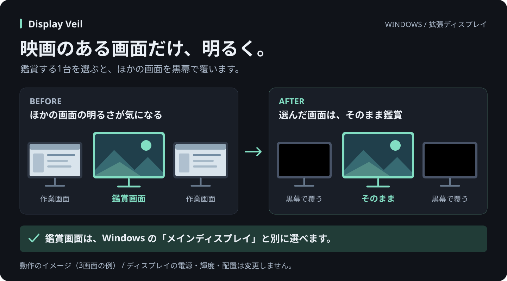
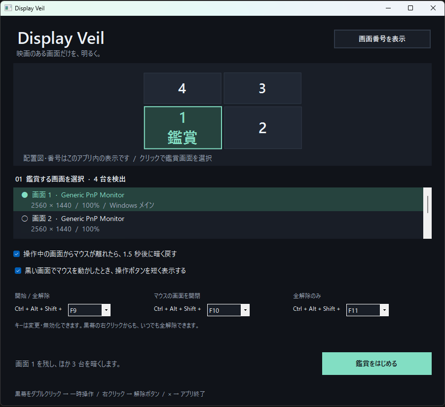
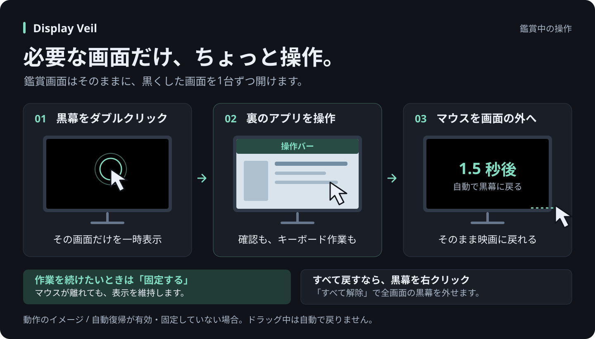

# Display Veil

**映画のある画面だけ、明るく。**

映画を見る画面を残し、ほかのディスプレイを黒く覆う Windows 向けフリーソフトです。
マルチディスプレイ環境で、ほかの画面の明るさが気になるときに使えます。



- **鑑賞する画面を自由に選択** — Windows の「メインディスプレイ」とは別に選べます。
- **必要な画面だけ一時操作** — 黒幕をダブルクリックすると、その画面のアプリを操作できます。
- **映画に戻ると自動で黒幕に** — 操作した画面からマウスが離れると、1.5 秒後に黒く戻ります。「固定する」で表示を維持することもできます。
- **展開してすぐ起動** — インストール・管理者権限は不要。通信・テレメトリ・常駐サービスもありません。

[ダウンロード（GitHub Releases）](https://github.com/check5004/DisplayVeil/releases) · [起動と使い方](#起動) · [鑑賞中の操作](#鑑賞中の操作) · [開発と検証](#開発と検証)

## 設定画面



4 台を接続した環境でのスクリーンショットです。配置図または画面一覧から、鑑賞する 1 台を選びます。
上の図解は 3 台での動作例で、台数や配置を固定するものではありません。

## 起動

[GitHub Releases](https://github.com/check5004/DisplayVeil/releases) の Assets から `DisplayVeil-<バージョン>-win.zip` を取得し、「すべて展開」して `DisplayVeil/DisplayVeil.exe` を開きます。
`Source code (zip)` にはビルド済み exe は含まれません。ソースからビルドした場合の起動先は `artifacts/DisplayVeil/DisplayVeil.exe` です。

| 必要な環境 | 内容 |
|---|---|
| OS | Windows 10 / 11 |
| ランタイム | .NET Framework 4.8 以降 |
| ディスプレイ | 2 台以上を Windows の「拡張」表示で接続 |
| 導入 | ZIP を展開して起動。インストール・管理者権限は不要 |

配布フォルダーの `.exe.config` を exe と一緒に置いてください。

1. 「画面番号を表示」で実際の画面と配置図を照合します。番号はアプリ内の番号です。
2. 配置図または画面一覧で、映画を見る画面を選択します。
3. 「鑑賞をはじめる」を押すと、設定画面が隠れ、選択した画面以外が黒くなります。

## 鑑賞中の操作



図解は自動復帰が有効で、表示を固定していない場合の動作です。

| やりたいこと | 操作 |
|---|---|
| 黒い画面の裏のアプリを操作 | 黒い部分をダブルクリック。またはマウス移動で表示される「この画面を操作」 |
| 映画に戻る | 操作していた画面からマウスを離すと 1.5 秒後に黒く戻る |
| キーボード作業などを続ける | 操作中の上部バーで「固定する」。マウスが離れても開いたまま |
| 手動で黒く戻す | 操作中の上部バーで「暗く戻す」 |
| 黒幕を全部解除 | 黒い部分を右クリック →「すべて解除」、操作バーの「全解除」、またはトレイメニュー |
| 設定・鑑賞画面を変更 | 通知領域のアイコンをダブルクリック、または exe をもう一度起動。全解除して設定を表示 |
| 完全終了 | 設定画面の ×、またはトレイメニュー「Display Veil を終了」 |

移動だけでは裏のアプリを表示しません。操作案内は約 2.5 秒で消えます。
案内をオフにしても、ダブルクリックと右クリックは使えます。
自動で黒く戻す機能は設定で無効にできます。ドラッグ中は自動で戻りません。

| 初期ショートカット | 操作 |
|---|---|
| Ctrl + Alt + Shift + F9 | 開始 / 全解除 |
| Ctrl + Alt + Shift + F10 | マウスがある画面を一時表示 / 黒く戻す |
| Ctrl + Alt + Shift + F11 | 全解除のみ |

キーは設定画面で変更・無効化できます。他アプリによる登録や重複で利用できない場合は、設定画面に表示します。
競合検出は Windows に登録されたグローバルキーが対象です。アプリ固有のキー割当てすべてを検出するものではありません。
鑑賞画面で F10 を使っても、その画面は覆いません。

## 画面・動作の仕様

- 台数の固定上限は設けていません。Windows が拡張デスクトップとして列挙する画面ごとに黒幕を作ります。実際の接続上限は Windows・GPU に依存します。
- 横長、縦置き、異なる解像度、負の座標、混在する拡大率に対応する設計です。
- 接続変更・解像度変更・拡大率変更では全解除します。表示された設定で鑑賞画面を確認して再開してください。
- ロック・スリープ時は全解除します。起動・復帰時に自動で黒くすることはありません。
- ディスプレイの電源や輝度、配置は変更しません。液晶ではバックライトの光が残る場合があります。
- 通常のデスクトップ上の最前面ウィンドウを使います。UAC・ロック画面・Ctrl+Alt+Delete・排他的フルスクリーン・一部のシステム UI や他の最前面アプリを常に覆える保証はありません。
- ミラー（複製）表示では、同じ映像を表示している物理画面を個別に黒くできません。Windows の拡張表示を使用してください。
- マウスによる黒幕操作は映画側のフォーカスを奪わず、ダブルクリックを裏のアプリへ転送しません。裏のアプリを実際にクリックすると、そのアプリにフォーカスが移ります。
- 黒幕は画面の保護・情報漏洩防止機能ではありません。
- 設定は `%LOCALAPPDATA%\DisplayVeil\settings.json` に保存します。通信・テレメトリ・常駐サービスはありません。

## 開発と検証

Windows PowerShell または PowerShell で、プロジェクト直下から実行します。

```powershell
.\build.ps1 -Test
```

配布用ZIPも作る場合は `.\build.ps1 -Test -Package` を実行します。
ZIPとSHA-256は `artifacts/release/` に生成します。

GitHub Actionsではpush・PR時にビルドとテストを行い、`v1.0.0`形式のタグをpushすると、exeを含むZIPをGitHub Releasesへ公開します。
初回設定・バージョン更新・公開手順は [配布の手順](docs/RELEASING.md) を参照してください。

NuGet や追加 SDK は使用せず、Windows の .NET Framework コンパイラーでビルドします。
ソースは `src/`、テストは `tests/`、設計は [設計ドキュメント](docs/DESIGN.md)、実機チェック項目は [テスト手順](docs/TESTING.md) を参照してください。

検証用に設定の保存先を分ける場合:

```powershell
.\artifacts\DisplayVeil\DisplayVeil.exe --settings-dir .\artifacts\manual-settings
```

## 紹介記事・画像素材

ブログ向けに、編集できる SVG 図解と掲載用 PNG を [docs/images/](docs/images/) に用意しています。
Qiita 向けの紹介記事は [テキスト原稿](docs/blog/qiita-display-veil.txt)、画像の対応表と掲載手順は [記事・画像の使い方](docs/BLOGGING.md) を参照してください。
